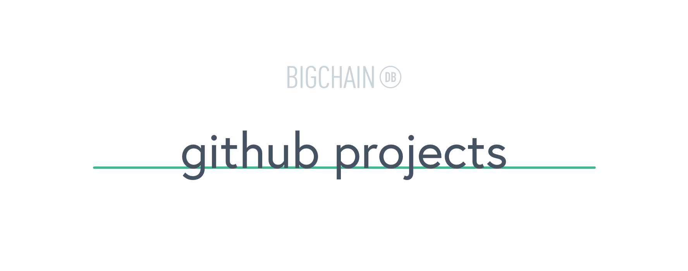

# [](https://www.bigchaindb.com)

> Microservice to cache and expose GitHub projects for use throughout [www.bigchaindb.com](https://www.bigchaindb.com).

[](https://travis-ci.org/bigchaindb/github-projects)
[](https://github.com/sindresorhus/xo)


## API

Endpoint: [`https://bigchaindb-github.now.sh`](https://bigchaindb-github.now.sh)

### GET /

**200**: Returns a list of all public projects as follows

```json
[
  {
    "name": "project-name",
    "description": "The description",
    "stars": 3040,
    "forks": 293,
    "is_fork": false,
    "release": "v0.10.0",
    "url": "https://github.com/bigchaindb/project"
  }
]
```

## Development

Install dependencies:

```bash
npm install
```

And run the server:

```bash
npm start
```

## Deployment

Deploy to [now](https://zeit.co/now), make sure to switch to BigchainDB org before deploying:

```bash
# first run
now login
now switch

# deploy
now
# switch alias to new deployment, e.g.
now alias bigchaindb-github-projects-wxkyissxos bigchaindb-github
```

## Authors

- Matthias Kretschmann ([@kremalicious](https://github.com/kremalicious)) - [BigchainDB](https://www.bigchaindb.com)

Blatantly ~~copied from~~ inspired by [zeit/github-projects](https://github.com/zeit/github-projects)
